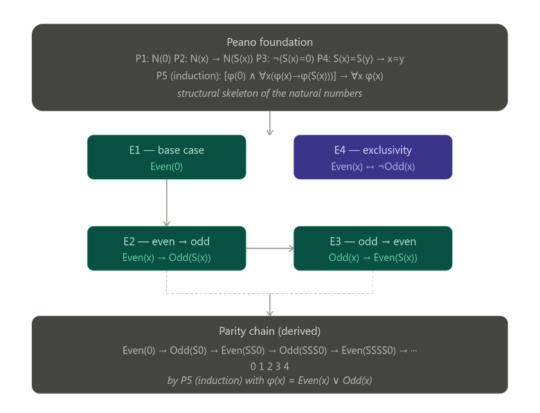

#+TITLE: 
#+AUTHOR: 
#+EMAIL: 
#+DATE: 2026-03-20T19:57:04Z UTC 
#+LANGUAGE:  en 
#+EXPORT_FILE_NAME: Agda4.html
# --- Configurations ---
#+SETUPFILE: /home/galaxybeing/Dropbox/org/tufte-html-setup.org
#+SETUPFILE: /home/galaxybeing/Dropbox/org/math-latex-setup.org
# --- Configurations ---
#+SETUPFILE: /home/galaxybeing/Dropbox/org/tufte-html-setup.org
#+SETUPFILE: /home/galaxybeing/Dropbox/org/math-latex-setup.org
# --- Bibliography ---
#+bibliography: /home/galaxybeing/Dropbox/org/biblio/ref.bib
#+cite_export: csl
# --- Document Content Starts Here ---
#+INCLUDE: /home/galaxybeing/Dropbox/org/codeismathiscode2/header.org :minlevel 1
#+LATEX_HEADER: \usepackage{amsmath}
#+LATEX_HEADER: \usepackage{amssymb}

* Parity in first-order logic via Peano's Axioms

** The Foundation: Peano's Axioms (relevant subset)

We work in a **signature** with a constant \(0\), a unary successor
function \(S\), and two predicates we will define: \(\text{Even}(x)\)
and \(\text{Odd}(x)\).

⥤ Now a quick in situ /math holiday/ to explain what is meant by a
**signature** 

@@html:@@
In mathematical logic, a **signature** (also called a *vocabulary* or
*language*) is simply the inventory of symbols you declare before
writing any formulas. It tells you what the non-logical building
blocks of your theory are, sorted into three kinds:

- **Constants** — named individuals, here just `0`
- **Function symbols** — operations that take arguments and return a
  term, here `S` (which takes one argument, making it "unary")
- **Predicate symbols** — relations that take arguments and return
  true/false, here `Even` and `Odd`

The signature is essentially the type signature of your theory before
any axioms are stated. It says nothing about what these symbols /mean/
--- that is the job of the axioms. The signature just declares that
these symbols exist and how many arguments each one takes (this is
called the *arity*).

So when we say, "We work in a signature with...", it is doing the same
thing a programmer does when declaring types or interfaces before
writing any logic: establishing the alphabet of the formal language
within which all the subsequent formulas will be written.

In more formal presentations you will sometimes see this written as a
tuple like $L = ⟨0, S, Even, Odd⟩$ or broken into $L = ⟨{0}, {S/1},
{Even/1, Odd/1}⟩$ where the $/1$ denotes arity 1. Below, the axioms
P1–P5 and E1–E4 are then all formulas *in* this language L, and any
model of the theory is a set together with an interpretation of each
symbol in $L$ that satisfies all the axioms.
@@html:@@

The natural numbers are the smallest set closed
under these axioms.

- *P1* --- Zero is a natural number: \(N(0)\)
- *P2* --- Successor closure: \(\forall x\,[\,N(x) \rightarrow N(S(x))\,]\)
- *P3* --- Zero is not a successor: \(\forall x\,[\,\neg(S(x) = 0)\,]\)
- *P4* --- Successor injectivity:
  \(\forall x\,\forall y\,[\,S(x) = S(y) \rightarrow x = y\,]\)
- *P5* --- Induction schema: for any predicate \(\varphi\)
  \[
  \bigl[\,\varphi(0) \;\wedge\; \forall x\,(\varphi(x) \rightarrow \varphi(S(x)))\,\bigr]
  \;\rightarrow\;
  \forall x\,\varphi(x)
  \]

** Defining Even and Odd by Structural Recursion

Rather than importing division or multiplication, we define parity purely in
terms of the successor structure. These four axioms are the core of the
"algorithm":

- *E1* --- Zero is even:
  \[
  \text{Even}(0)
  \]

- *E2* --- Odd is the successor of even:
  \[
  \forall x\,[\,\text{Even}(x) \rightarrow \text{Odd}(S(x))\,]
  \]

- *E3* --- Even is the successor of odd:
  \[
  \forall x\,[\,\text{Odd}(x) \rightarrow \text{Even}(S(x))\,]
  \]

- *E4* --- Parity is exhaustive and exclusive:
  \[
  \forall x\,[\,N(x) \rightarrow (\text{Even}(x) \leftrightarrow \neg\,\text{Odd}(x))\,]
  \]

Axiom E4 is derivable from E1--E3 plus induction, but stating it explicitly
makes the system self-contained without needing to invoke P5 at the object level.

** Derived Theorems

From these axioms alone, by applying P5 (induction) with
\(\varphi(x) = \text{Even}(x) \vee \text{Odd}(x)\):

| Numeral      | Term          | Derivation                        | Parity |
|--------------+---------------+-----------------------------------+--------|
| \(0\)        | \(0\)         | E1 directly                       | Even   |
| \(1\)        | \(S(0)\)      | E2 applied to E1                  | Odd    |
| \(2\)        | \(S(S(0))\)   | E3 applied to row above           | Even   |
| \(3\)        | \(S(S(S(0)))\)| E2 applied to row above           | Odd    |
| \(4\)        | \(S^4(0)\)    | E3 applied to row above           | Even   |
| \(\vdots\)   | \(\vdots\)    | \(\vdots\)                        | \(\vdots\) |

To "test" whether a concrete numeral \(n\) is even, unfold its \(S\)-chain
and apply E1--E3 alternately: parity is read off at the end. This is the FOL
analogue of the recursive algorithm:

#+BEGIN_EXAMPLE
isEven(0) = true
isEven(n) = isOdd(n - 1)
isOdd(0)  = false
isOdd(n)  = isEven(n - 1)
#+END_EXAMPLE

** Axiom Structure Diagram

#+CAPTION: How the Peano foundation and parity axioms interlock.
#+NAME: fig:axiom-structure

** A Note on Completeness

This system is complete for parity testing in the following sense: for any
closed term \(t\) built from \(0\) and \(S\), exactly one of \(\text{Even}(t)\)
or \(\text{Odd}(t)\) is provable, and which one is determined in a finite number
of steps equal to the value of \(t\). It is, in this sense, a decision
procedure---just expressed as logical derivation rather than as a loop or
conditional branch.

The deep connection to computation is that E1--E3 are essentially the
definition of a two-state finite automaton:

- *States*: \(\{\text{Even},\, \text{Odd}\}\)
- *Start state*: \(\text{Even}\)
- *Transition*: flip state on every application of \(S\)

\[
\text{Even} \xrightarrow{S} \text{Odd} \xrightarrow{S} \text{Even}
\xrightarrow{S} \text{Odd} \xrightarrow{S} \cdots
\]

Peano induction (P5) is what guarantees the automaton terminates and covers
every natural number.

* Signatures, Agda, and First-Order Logic

** What a Signature Is in FOL

In classical first-order logic, a *signature* (also called a /vocabulary/
or /language/) is the declared inventory of non-logical symbols, sorted
into three kinds:

- *Constants* --- named individuals, e.g. $0$
- *Function symbols* --- operations returning a term, e.g. $S$ (arity 1)
- *Predicate symbols* --- relations returning true/false, e.g. $Even$, $Odd$

Formally one writes this as a tuple

\[
L \;=\; \langle\, \{0\},\; \{S^{(1)}\},\; \{\text{Even}^{(1)},\, \text{Odd}^{(1)}\} \,\rangle
\]

where the superscript denotes arity. The signature says nothing about
/meaning/; that is the job of the axioms. It is purely the alphabet of
well-formed terms and formulas.

** The Agda Analogue

Agda is a dependently typed programming language and proof assistant. It
does not have a separate notion called "signature", but the same
conceptual job is done --- in a richer way --- by a combination of
language features.

*** Constants become values or constructors

In FOL the constant $0$ is simply declared to exist. In Agda you give it
a type, and it exists as the first constructor of the ~ℕ~ data type:

#+BEGIN_SRC agda
data ℕ : Set where
  zero : ℕ
  suc  : ℕ → ℕ
#+END_SRC

This single block does the work of both the FOL signature entry for $0$
(and $S$) /and/ axioms P1 and P2 simultaneously. The declaration is not
separate from the meaning --- the constructors ~zero~ and ~suc~ /are/ the
canonical proof that these things exist.

*** Function symbols become typed function declarations

In FOL, $S$ is declared as a unary function symbol in the signature, with
no further content. In Agda, every function must be given a full type:

#+BEGIN_SRC agda
suc : ℕ → ℕ
#+END_SRC

The type ~ℕ → ℕ~ plays the role of the arity annotation $S^{(1)}$, but it
is strictly more informative: it states the /domain/ and /codomain/, not
just a count. In a dependently typed setting the type can express
arbitrarily rich constraints that FOL arity cannot.

*** Predicate symbols become types (propositions-as-types)

This is where the deepest difference lies. In FOL, $\text{Even}$ is a
predicate symbol declared in the signature; its meaning is given by axioms
E1--E3 and a model. In Agda, under the
/propositions-as-types/ (Curry--Howard) correspondence, a predicate is a
function into ~Set~ (the universe of types):

#+BEGIN_SRC agda
data Even : ℕ → Set where
  even-zero : Even zero
  even-suc  : ∀ {n} → Odd n → Even (suc n)

data Odd : ℕ → Set where
  odd-suc : ∀ {n} → Even n → Odd (suc n)
#+END_SRC

A value of type ~Even n~ is not merely a truth value --- it is a
/proof object/, a concrete witness that ~n~ is even. The FOL axioms
E1, E2, E3 have become the constructors ~even-zero~, ~even-suc~, and
~odd-suc~. There is no separate axiom layer; the constructors carry the
content directly.

** Side-by-Side Comparison

| Concept            | FOL signature + axioms              | Agda                                      |
|--------------------+-------------------------------------+-------------------------------------------|
| Constant $0$       | Symbol declared in \(L\); P1 axiom  | Constructor ~zero : ℕ~                    |
| Function $S$       | Symbol $S^{(1)}$ in \(L\); P2 axiom | Constructor ~suc : ℕ → ℕ~                 |
| Predicate $Even$   | Symbol $\text{Even}^{(1)}$ in \(L\) | Type family ~Even : ℕ → Set~              |
| Axiom E1           | \(\text{Even}(0)\)                | Constructor ~even-zero : Even zero~       |
| Axiom E2           | \(\forall x[\text{Even}(x) \rightarrow \text{Odd}(S(x))]\) | Constructor ~odd-suc : Even n → Odd (suc n)~ |
| Axiom E3           | \(\forall x[\text{Odd}(x) \rightarrow \text{Even}(S(x))]\) | Constructor ~even-suc : Odd n → Even (suc n)~ |
| Axiom P5 (induction) | Separate schema over all \(\varphi\) | Built into ~data~ recursion and structural induction |
| Proof of $Even(2)$ | Derivation: E1 then E3              | Term: ~even-suc (odd-suc even-zero)~      |
| Excluded middle    | Assumed (classical FOL)             | Not assumed; must be proved or postulated |

** The Key Conceptual Differences

*** Separation vs. fusion

In FOL, the signature and the axioms are strictly separated. The signature
declares symbols; the axioms constrain them. You could in principle
interpret $\text{Even}$ as any unary predicate and check whether it
satisfies the axioms. In Agda, declaration and meaning are fused: writing
the ~data~ block simultaneously introduces the type, its constructors, and
the induction principle. There is no room for an "unintended model".

*** Arity vs. type

FOL records only a natural number (the arity) for each symbol:
\(S^{(1)}\) means "takes one argument". Agda records a full dependent
type. For the simple Peano case the difference is small --- ~suc : ℕ → ℕ~
carries little more than arity 1 does. But for richer theories the
difference is enormous: an Agda type can enforce that a function only
accepts even numbers, or that a vector has a specific length, in a way
that a bare arity annotation cannot.

*** Truth values vs. proof objects

In FOL, $\text{Even}(4)$ is a /proposition/ --- a sentence that is either
true or false in a given model. In Agda, ~Even 4~ is a /type/, and to
assert it you must produce a term of that type:

#+BEGIN_SRC agda
proof-4-even : Even (suc (suc (suc (suc zero))))
proof-4-even = even-suc (odd-suc (even-suc (odd-suc even-zero)))
\end{SRC}

The proof is not a certificate attached to a truth value --- it /is/ the
value, in the sense of the Curry--Howard correspondence:

\[
\text{propositions} \;\longleftrightarrow\; \text{types}
\qquad
\text{proofs} \;\longleftrightarrow\; \text{terms}
\]

*** Classical vs. constructive logic

FOL as standardly used is /classical/: the law of excluded middle
\(\varphi \vee \neg\varphi\) holds for free. Agda is /constructive/ by
default. The statement

\[
\forall n,\; \text{Even}(n) \vee \text{Odd}(n)
\]

is an axiom schema in the FOL treatment (derivable from E1--E4 plus P5).
In Agda it must be proved by explicit recursion:

#+BEGIN_SRC agda
parity : ∀ (n : ℕ) → Even n ⊎ Odd n
parity zero        = inj₁ even-zero
parity (suc n)     with parity n
... | inj₁ e      = inj₂ (odd-suc e)
... | inj₂ o      = inj₁ (even-suc o)
#+END_SRC

Here ~⊎~ is the disjoint sum type (the constructive reading of "or"),
and each branch of ~with~ provides a concrete witness. The FOL induction
schema P5 has become the structural recursion on ~n~ that Agda's
termination checker verifies automatically.

** Summary

The FOL notion of a signature is the /declared interface/ of a theory ---
a minimal, meaning-free list of symbols and arities. Agda collapses this
interface into the type system itself: every symbol carries a type,
constructors encode axioms, and proofs are first-class computational
objects. The price is that Agda demands more from the user (explicit proof
terms, constructive witnesses); the gain is that the type checker
/enforces/ consistency, making an unintended model impossible by
construction.

#+INCLUDE: ./footer.org :minlevel 1

