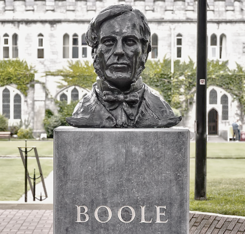

#+TITLE: 
#+AUTHOR: 
#+EMAIL: 
#+DATE: 2026-03-03T05:34:13Z UTC 
#+LANGUAGE:  en 
#+EXPORT_FILE_NAME: ComputingInContext1.html
# --- Configurations ---
#+SETUPFILE: /home/galaxybeing/Dropbox/org/tufte-html-setup.org
#+SETUPFILE: /home/galaxybeing/Dropbox/org/math-latex-setup.org
# --- Configurations ---
#+SETUPFILE: /home/galaxybeing/Dropbox/org/tufte-html-setup.org
#+SETUPFILE: /home/galaxybeing/Dropbox/org/math-latex-setup.org
# --- Bibliography ---
#+bibliography: /home/galaxybeing/Dropbox/org/biblio/ref.bib
#+cite_export: csl
# --- Document Content Starts Here ---
#+INCLUDE: /home/galaxybeing/Dropbox/org/codeismathiscode2/header.org :minlevel 1

* Computing in Context 1

\\
#+begin_figure
#+CAPTION: George Boole bust @ University College Cork.

#+end_figure
\\
#+begin_quote
In mathematics you don't understand things, you just get used to
them. \\
--- John von Neumann
#+end_quote

** Bibliography :noexport:
:PROPERTIES:
:header-args: :dir "/home/galaxybeing/Dropbox/org/codeismathiscode2"
:END:
:RESOURCES:
- [[bibliography:~/Dropbox/org/biblio/ref.bib][Bibliography]]
- [[cite:&friedman1995little]]
:END:

* 

** A first proof

Let's start with a proof.

At some point in your math education you were told /a __negative__
number times a __positive__ number always results in a __negative__
number/. Maybe this was explained by saying, e.g., $2 \times (-3)$ was just
like jumping on the number line /once/ back to $-3$, then jumping back
$-3$ /twice/ to reach $-6$. Another intuitive approach is to say you
are in debt by three dollars /twice/ for a total of six dollars of
debt, i.e., debt being an historical way to conceive of negative
numbers.[fn:1]

Another intuitive bridge is to see multiplication as just repeated
addition; that is, the multiplication of two numbers is equivalent to
adding as many copies of the **multiplicand**, as the quantity of the
**multiplier**. And so with a negative number times a positive number
we just assume the positive number must be the /multiplier/. Why? As
in our example $2 \times (-3)$, we can't really conceive of adding $2$ to
itself /negative/ three ($-3$) times. What does $-3$ times even mean?
But...

...but what? In higher math we explain a negative times a positive
equals a negative more theoretically, detached from intuition. In
higher math there is no concept of multiplicand and
multiplier. Instead, everything is based on, derived from the **field
axioms** of the real number system. Let's actually prove that a
negative real number times a positive real number equals a negative
real number the higher-math way.

First, let's write things more general. For numbers $a$ and $b$ we
will prove

$$(-a)b = -(ab)$$

To accomplish the we will use only these foundational /field
axioms/ [fn:2]

@@html:@@
- **Additive Inverse**: For every $x$, there exists some $-x$ such that
  $x + (-x) = 0$.
- **Distributive Law**: For any $x, y, z$, we have $(x + y)z = xz + yz$.
- **Multiplication by Zero**: For any $x$, $x \cdot 0 = 0$.
- **Uniqueness of Additive Inverse**: If $x + y = 0$, then $y = -x$.
@@html:@@

|   <c>    |          <c>          |                                                                                                           <r> |
| **Step** |     **Equation**      |                                                                                             **Justification** |
|   <6>    |         <45>          |                                                                                                          <47> |
|    1.    |    $a + (-a) = 0$     |                                                                                     Additive Inverse for $a$. |
|    2.    | $(a + (-a))b = 0 \cdot b$ |                                                                                   Multiply both sides by $b$. |
|    3.    | $ab + (-a)b = 0 \cdot b$  |                                                                    Distributive Law applied to the left side. |
|    4.    |   $ab + (-a)b = 0$    |                                                             Multiplication by Zero applied to the right side. |
|    5.    |    $(-a)b = -(ab)$    | Uniqueness of the additive inverse (since adding $(-a)b$ to $ab$ yields $0$, it must be the inverse of $ab$). |
{{{marginnote(The square box at the end of a proof stands for **Q.E.D**,
Latin for /quod erat demonstrandum/, meaning "thus it is proved."
(Literally, "what was to be shown".)  Traditionally, the abbreviation
or square is placed at the end of mathematical proofs and
philosophical arguments to indicate that the proof or the argument is
complete.)}}}
@@html:
@@
$\square$ 
@@html:&nbsp;&nbsp;
@@

Walking through it, we start out with the basic /Additive Inverse/
equation, $a + (-a) = 0$ in Step 1. Next, we build on it by
multiplying both sides by $b$ (Step 2). Then we apply the
/Distributive Law/ to arrive at $ab + (-a)b = 0 \cdot b$ (Step 3). At Step
4 we simplify to $ab + (-a)b = 0$. Now we are left with what looks
like an /additive inverse/ situation---which means $(-a)b$ must indeed be
$-(ab)$ for the equation to equal $0$. The proof demonstrates how we
are /forced/ to accept $(-a)b = -(ab)$ (Step 5) to keep $ab + (-a)b =
0$ true.

@@html:@@
⥤ In higher math $(-a)b = -(ab)$ is considered a /theorem/
@@html:@@

...derived, /proved/ by logical deduction from axioms.

In our typical US Algebra 1 and 2 courses, students /implicitly/ rely
on the field axioms and their derived theorems without any of the
rigor of we just saw. For example:

- The *Zero Product Property* (if $ab = 0$, then $a = 0$ or $b = 0$)
  is fundamentally a theorem of /integral domains/ from abstract
  algebra, but high schoolers are generally just taught it as a
  functional "rule" for solving factored quadratics.
- The *Binomial Theorem* is encountered in Algebra 2, but it is
  frequently presented as a combinatorial pattern (via Pascal's
  Triangle) rather than rigorously proven using mathematical
  induction.

** Formalize to operationalize

As we progress, the point will be driven home that /modern computer
technology is tightly intertwined with higher math and mathematical
logic/, and so, /we formalize to operationalize/. This is not meant to
scare, rather, to intrigue you. This is the very sort of higher
math studied in college computer science departments. And preparing
you for college-level comp-sci is what this is all about. But, you
might counter, I don't necessarily want to study comp-sci. To that we
say, Yes you do---at least the basics of how computers work.

@@html:@@⥤ Everyone should know the basics of
computing, the most important technology the human race has ever
created.@@html:@@

Let's get started.

Often enough with math textbooks the first chapter is devoted to a
sort of "overture" of the topics to be discussed, a 30,000-foot view
of what's to come in the rest of the book. And we'll do something like
that here in our intro chapter. The main goal will be to expose just
how different higher math can be from the basic math of K-12. While
basic math---all the way through Calculus and Differential Equations
in college---is about getting solutions to problems, higher math can
be downright /philosophical/. But why do we have to worry about higher
math in the first place? As we've discussed in the Preface, the theory
that grew alongside the development of digital computers has always
been formal, rigorous higher math. /It had to be./ And yes, our
catchphrase, /formalize to operationalize/[fn:3] is central to
everything we'll be doing. We need to move away from intuition,
conditioned instincts, hunches, and the guesswork of the past and
toward understanding math at a more fundamental level using exacting,
formal methods---which can then be codified, systematized,
/operationalized/ for the computer.

This chapter will be an odd, quirky sort of dive into how to upgrade
your understanding of algebra, how to lift it out of the mirky,
intuitive, seat-of-pants methods you've learned so far and move it
into more systematic, rule-based procedures. We need to know how and
whys, and not just guess-and-test our way along. Again, why?  /Because
computability in general and computer operation specifically must be
grounded in logical entailment/. Higher math is all about the
packaging and handling logic and gaining mastery of its consequences,
and once we have a theoretical grasp, we can move over to the world of
computation.

To be sure, experiencing how higher math "hangs together" can be a
marvel, i.e., discovering all the interlocking, interconnected logical
consequences. Initially, however, it can be a frustrating descent into
confusion, that is, until your next eureka moment lands. What follows
in this, our intro chapter, will seem challenging; but in the spirit
of math textbooks' first chapters, /do not panic/, do not take this
too seriously, do not attempt to rote learn or memorize; rather, just
go along for the ride: read, re-read, even do your own
investigations.[fn:4] Above all, don't worry! everything mentioned
here will be fleshed out, all relevance thoroughly established in
subsequent lessons.

** Show your work!

Higher math is all about creating elegant, self-contained,
self-referential, soup-to-nuts groupings of theories that /scale/ and
can be applied widely. Reach a higher plateau, and you can see much
farther. Higher math always seeks to /generalize/, to be maximally
universal, good for all cases. Why?  Because consistent systems of
symbolism and generalization offer us the deepest possible
understanding of a subject. Recall with Einstein's [[https://en.wikipedia.org/wiki/General_relativity][General relativity]]
that gravity, an everyday, real-world phenomenon, has, through
Einstein, become an /artefact/, literally a logical consequence of a
mathematical system. Bottom line: /Einstein gave us a much deeper and
expansive understanding of what physical reality is./ That's an
incredible boon, nothing short of a superpower we humans have gained
over life here in the universe.[fn:5]

Let's begin with that odd-seeming request many algebra teachers have
nagged their algebra students with when solving algebra homework
problems: "Show your work!" Seemingly out of the blue, for no apparent
reason, teachers want to see all the /steps/ their students take to
arrive at a final answer. Why? Could it be that by listing every step
we may demonstrate more clearly our process of solving a problem? And,
yes, if we hit a snag or get the wrong answer, we can better narrow
down where we we're going wrong. This is the first inkling of how
higher math seeks to systematize. Let's take "show your steps" further
by involving the foundational **rules** or **[[https://en.wikipedia.org/wiki/Axiom][axioms]]**[fn:6] that we
started with earlier.

Below are /properties/ we can consider axioms or given facts, a sort
of foundational starter list. This is a generic grouping as can be
found in many textbooks. You've probably seen most of them---and not
really known what they were for, as in, Why do I need to worry about
this stuff? Peruse, then we'll look at how to use them. Then we'll get
into the details, especially the magical world of logical entailment
they engender.

@@html:@@
**Properties of Arithmetic**

For any numbers $a$, $b$, and $c$:

- **Axiom 1**: /Commutative properties---addition, multiplication/ \\
  $a + b = b + a\;; \quad ab = ba$
- **Axiom 2**: /Associative properties---addition, multiplication/ \\
  $(a + b) + c = a + (b + c)\;; \quad (ab)c = a(bc)$
- **Axiom 3**: /Distributive property/ \\
  $a(b + c) = ab + ac$
- **Axiom 4**: /Existence of identity elements/ \\
  There exist two distinct numbers, $0$ and $1$, such that for every
  $a$ we have $a + 0 = a$ and $a \cdot 1 = a$
- **Axiom 5**: /Existence of negatives/ \\  
  For every number $a$ there is a number $b$ such that $a + b = 0$
- **Axiom 6**: /Existence of reciprocals/ \\  
  For every number $a \ne 0$ there is a number $b$ such that $ab = 1$,
  e.g., $b = \frac{1}{a}$

**Properties of Equality**

For any numbers $a$, $b$, $c$, and $d$:

- /Reflexive property/ \\
  $a = a$ ...any number is equal to itself.
- /Transitive property/ \\
  If $a = b$ and $b = c$, then $a = c$ ...this property often takes the
  form of the substitution property, which says that if $b = c$, you can
  substitute $c$ for $b$. 
- /Symmetric property/ \\
  If $a = b$, then $b = a$
- /Addition property/ \\
  If $a = b$, then $a + c = b + c$ ...also, if $a = b$ and
  $c = d$, then $a + c = b + d$
- /Subtraction property/ \\
  If $a = b$, then $a − c = b − c$ ...also, if $a = b$ and $c = d$, then $a − c = b − d$
- /Multiplication property/ \\
  If $a = b$, then $ac = bc$ ...also, if $a = b$ and $c = d$, then $ac = bd$
- /Division property/ \\
  If $a = b$, then $\frac{a}{c} = \frac{b}{c}$ provided $c \ne 0$
- /Square root property/ \\
  If $a^2 = b$, then $a = \pm\sqrt{b}$
- /Zero product property/ \\
  If $ab = 0$, then $a = 0$ or $b = 0$ or both $a$ and $b = 0$
@@html:@@

We saw four of these above. So let us solve a simple algebra
expression for $x$, adding in /justifications/ from the properties
above for each step[fn:7]

⌜\\
𝖟𝕭: Solve $5x - 12 = 3(x + 2)$ for $x$: 
\begin{align*}
5x - 12 &= 3(x + 2) \quad \quad &&\text{Given} \\
5x - 12 &= 3x +6 \quad \quad &&\text{Distributive Property} \\
5x &= 3x + 18 \quad \quad &&\text{Addition property of equality} \\
2x &= 18 \quad \quad &&\text{Subtraction property of equality} \\
x &= 9 \quad \quad &&\text{Division property of equality} \\
\end{align*}
⌟ \\

All right, we've shown our work, step-by-step, and like the proof
above, we also /justified/ each **rewrite**[fn:8] of each step by
attaching one of the rules above, /Distributive Law, Addition property
of equality/, etc., to each line. Now, it's highly doubtful any middle
or high school algebra teacher discussed algebra with regards to
axioms or asked you to do such a double-column style as above. But in
fact, from these axioms we can derive the workings of algebra. Again,
we are out to /systematize/ and /operationalize/ algebra.

So far so strange... Typically, when you were first learning algebra
there was no talk about formal, systematic methods. Instead, you
watched and followed what the teacher was doing, picked up on, made
sense of the rules, looking for patterns and clues in what you saw. In
effect, you learned in an instinctive, pattern-recognition way to
solve problems---reinforced with much imitation and repetition. You
/internalized/ the methods without going into any further
depth. However, starting at the university, you will be required to
grasp things at a more systematic level. You'll be introduced to the
greater world of **[[https://en.wikipedia.org/wiki/Formalism_(philosophy_of_mathematics)][mathematical formalism]]**.

With axiomatic mathematics we start with a set of axioms, i.e.,
givens, rules, laws, statements to be taken as the most basic,
atomic[fn:9] facts, then employ **[[https://en.wikipedia.org/wiki/Deductive_reasoning][deductive reasoning]]** to /prove/
further statements or **[[https://en.wikipedia.org/wiki/Theorem][theorems]]**. Here's Kenneth Rosen from his /[[https://www.mheducation.com/highered/product/Discrete-Mathematics-and-Its-Applications-Rosen.html][Discrete
Mathematics and Its Applications]]/ a widely-used college textbook in
computer science departments where he emphasizes **[[https://en.wikipedia.org/wiki/Mathematical_proof][proof]]**

#+begin_quote
To understand mathematics, we must understand what makes up a correct
mathematical argument, that is, a **proof**. Once we /prove/ a
mathematical statement is true, we call it a **theorem**. A collection
of theorems on a topic organize [into] what we know about this topic.
#+end_quote

Taken together, a set of proven theorems becomes the body of a
particular branch of math. The axiom-to-theorems approach is
diametrically opposed to typical K-12 "muscle-memory" math where
methods aren't taught in the form of theorems; instead, the mantra is,
"When you see this, do this."

Let's take a quick in situ /math holiday/[fn:10] to give another
example of how proof---in this case the lack thereof---plays an
important role in real-world mathematical computation.

⇲ @@html:@@ The **Collatz conjecture** is one
of the most famous "unsolved problems" in mathematics. Also known as
the $3n + 1$ problem, it is deceptively simple, i.e., a child can
understand the rules, yet the world’s greatest mathematicians have
failed to /prove/ it will always terminate and not just keep
running. The /Collatz conjecture/ says...

...starting with any positive integer $n$, if we apply these two steps to
some number $n$ repeatedly, we should eventually wind up at the number
$1$:

- If $n$ is even: Divide it by $2$ ($n/2$).
- If $n$ is odd: Multiply it by $3$ and add $1$ ($3n+1$).
@@html:@@

⌜\\
𝖟𝕭: Starting with n = 7

1. $7$ is odd: $(3 \cdot 7)+1=22$
2. $22$ is even: $22/2=11$
3. $11$ is odd: $(3 \cdot 11)+1=34$
4. $34$ is even: $34/2=17$
5. $17$ is odd: $(3 \cdot 17)+1=52$
6. $52$ is even: $52/2=26$
7. $26$ is even: $26/2=13$
8. $13$ is odd: $(3 \cdot 13)+1=40$
9. $40$ is even: $40/2=20$
10. $20$ is even: $20/2=10$
11. $10$ is even: $10/2=5$
12. $5$ is odd: $(3 \cdot 5)+1=16$
13. $16$ is even: $16/2=8$
14. $8$ is even: $8/2=4$
15. $4$ is even: $4/2=2$
16. $2$ is even: $2/2=1$ (Target reached)
⌟ \\
 
Running this computation for $n = 7$, we do indeed get to $1$ in
sixteen steps. But then we're stuck in a so-called "trivial loop,"
i.e., at Step 16 we get $1$ --- then by strictly following the recipe
we keep going: $1$ is odd, hence, multiply by $3$ and add $1$ getting
$4$, which is even, then divide by $2$, which is $2$, then divide by
$2$ and we're back at $1$ --- over and over. If we've written a
program to run the Collatz, and our software is not told to break the
trivial loop, the reducing game will go on indefinitely.

@@html:@@ ⥤ Knowing if a program ends properly
or just keep running is very important in the computer world.
@@html:@@

Is something computable? is the basic question. The so-called
**[[https://en.wikipedia.org/wiki/Halting_problem][Halting problem]]** deals with whether a piece of software will finish
running or continue to run forever. However, it has been proven that
the halting problem is __undecidable__, meaning that /no general way
exists that solves the halting problem for all possible programs and
their input/. This demonstrates that we can define some things
mathematically but not actually know how to compute them. Lots more
later.[fn:11]

Mathematicians have not been able to /prove/ the Collatz conjecture
always terminates at $1$ for all $n$, therefore, we cannot know for
certain whether any given number can be reduced to $1$, or whether the
calculations just keep running forever. This is a good example of why
proving conjectures, statements is crucial. Now, could a computer
simply keep trying ever bigger numbers? Yes, but that's what's known
as applying "brute force," i.e., not really desirable. With the
Collatz conjecture they have indeed applied brute force---out to $2.36
\times 10^{21}$, a colossal number. However, in the real world of math and
computer science we work towards known, provable outcomes. This means
we need tools to analyze computations. We even want to prove[fn:12]
what a computation does. Ironically, the whole question of what is
computable and what is not began in earnest, at least theoretically,
on paper, back in the 1930s, /long before a single electronic
computing device actually existed/.[fn:13]

** Algebra built from axioms

Cal Tech math professor [[https://en.wikipedia.org/wiki/Tom_M._Apostol][Tom Apostol]] in his /[[https://en.wikipedia.org/wiki/Calculus_(Apostol_books)][Calculus...]]/ textbook
starts with higher math-style foundation-laying for Calculus,[fn:14]
essentially formalizing, abstracting the arithmetic we've taken for
granted since grade school, e.g., simple adding and multiplying. His
language is---formal, but we'll dissect it piece-by-piece. This is how
he starts[fn:15]

⇲@@html:&nbsp;@@Along with the /set/
$\mathbb{R}$ of **real numbers**, we assume the existence of two
operations called **addition** and **multiplication**, such that for
every pair of real numbers $x$ and $y$ we can form the **sum** of $x$
and $y$, which is another real number denoted by $x + y$, and the
**product** of $x$ and $y$, denoted by $xy$ or by $x \cdot y$, which is
also another real number. It is assumed that the sum $x + y$ and the
product $xy$ are /uniquely/ determined by $x$ and $y$. In other words,
given $x$ and $y$, there is /exactly one/ real number $x + y$ and
/exactly one/ real number $xy$. We attach no special meanings to the
symbols $+$ and $\cdot$ other than those contained in the axioms.
@@html:@@

...then he gives what he calls the **field axioms**[fn:16]

@@html:@@
For any numbers $a$, $b$, and $c$:

- **Axiom 1**: /Commutative properties---addition, multiplication/ \\
  $a + b = b + a\;; \quad ab = ba$
- **Axiom 2**: /Associative properties---addition, multiplication/ \\
  $(a + b) + c = a + (b + c)\;; \quad (ab)c = a(bc)$
- **Axiom 3**: /Distributive property/ \\
  $a(b + c) = ab + ac$
- **Axiom 4**: /Existence of identity elements/ \\
  There exist two distinct numbers, $0$ and $1$, such that for every
  $a$ we have $a + 0 = a$ and $a \cdot 1 = a$
- **Axiom 5**: /Existence of negatives/ \\  
  For every number $a$ there is a number $b$ such that $a + b = 0$
- **Axiom 6**: /Existence of reciprocals/ \\  
  For every number $a \ne 0$ there is a number $b$ such that $ab = 1$,
  e.g., $b = \frac{1}{a}$
@@html:@@

Apostol has put together a /tool bag/ starting with the real numbers,
adding the operations addition and multiplication, then connecting
objects and operations with the six axioms. Notice, however, he
doesn't teach us how to add or multiply; instead, we're getting a
purely /symbolic/ and theoretic /operational/ treatment. And when he
says he "attaches no special meaning" to the /symbols/ $+$ and $\cdot$,
he's all but saying what $+$ and $\cdot$ do is secondary to the symbolic
machinery he has constructed. Why? Because we're now in the world of
/symbolic manipulation/.[fn:17] Consider this quote from the Wikipedia
article on Logic

#+begin_quote
/Formal/ logic (also known as **[[https://en.wikipedia.org/wiki/Logic#Formal_logic][symbolic logic]]**) is widely used in
mathematical logic. It uses a formal approach to study reasoning: it
replaces concrete expressions with abstract symbols to examine the
logical form of arguments independent of their concrete content. In
this sense, it is topic-neutral since it is only concerned with the
abstract structure of arguments and not with their concrete content.
#+end_quote

We'll take a deeper dive into mathematical logic soon, but for now
think back on when you were introduced to basic /[[https://en.wikipedia.org/wiki/Syllogism][syllogisms]]/. For
example

#+begin_example
  All men are mortal.
  All Greeks are men.
∴ All Greeks are mortal.
#+end_example

can be generalized by letter symbols as[fn:18]

#+begin_example
Major premise: All M are P.
Minor premise: All S are M.
Conclusion:    All S are P.
#+end_example

...and, seemingly at least, it doesn't matter what the symbols
actually mean concretely, just that we can manipulate symbols
formulaically, /algorithmically/ according to the rules of
logic. Hmm. It's almost like Apostol wants to explain Calculus to a
robot or a computer. Hold that thought. We'll soon look into the great
leap computing made riding on the back of formal or symbolic
logic. The rules for manipulating purely symbolic object, e.g.,
letters of the alphabet, words, have been carried very successfully
over into computing.[fn:19]

⥤ **Math holiday**: And now let's take an extended /ex situ/ math
holiday to figure out how deep the idea of /one unique answer/ to an
addition and multiplication operation can go. Click on the following
link: [[file:ComputingInContext1AuxExistUnique.html][Existence and uniqueness]].

...yes, a nice, long, relaxing math holiday can be so
refreshing... Back to Apostol who boldly states

#+begin_quote
All the workings of elementary algebra can be **deduced** from these
six [Properties of Arithmetic] axioms.
#+end_quote

To be sure, we're attempting to /deduce/ the workings of algebra from
axioms---all in this highly symbolic, non-intuitive proof way.

Math did not have this level of rigorous formalism until the
late-1800s when the world of mathematics began asking itself, Can we
really just /assume/, take for granted the operations we do in
arithmetic? The answer they came to was no, especially when modern set
theory and mathematical logic entered the picture. And so was birthed
mathematics based on setting up axioms then postulating and proving a
body of theorems. And throughout modern STEM we see this model of
starting with a set of basic, given facts, /axioms/, then using them
to derive theorems, i.e., a body of working parts.

In the algebra example above where we simplified $5x - 12 = 3(x + 2)$
to find $x$, each step was seemingly justified, matched with one of
the /Properties of Equality/ (PoE) arguments from our generic
introductory listing. But then Apostol doesn't mention PoE at all. Why
not? Higher math tells us that field axioms are meant for establishing
a /field/, typically for a specific number system like the real
numbers $\mathbb{R}$. The PoE, on the other hand, are considered more
basic and fundamental. In the words of one authority, the PoE are the
(first-order) logic that /sit underneath/ mathematics.

Apostol's very first theorem, **Theorem 1.1**, the /Cancellation law
for addition/, states[fn:20]

⇲@@html:@@ If $a + b = a + c$, then $b = c$. In
particular, this shows that the number $0$ of Axiom 4 is unique.
@@html:@@

First, let's note Apostol's field axioms do not include /Properties of
Equality/ (PoE) like we saw in our generic lists at the beginning of
this chapter, thus, he restricts justifying "both sides cancellation"
to only his field axioms. You've been balancing equations since ever,
but how does this definition, as it was just given, enable the
cancelling of "like things" on each side of an equation? Yes, we can
see $a$ on both sides, but... Then he ties in somewhat obscurely his
Axiom 4, saying the /uniqueness/ of $0$ is plays a role somehow. Next,
he lays out his proof:

⇲@@html:@@ Let us assume $a + b = a + c$ is
true. By Axiom 5 (see /Existence of negatives/ above), there exists a
number $y$ such that $y + a = 0$. Since sums are uniquely determined,
we have $y + (a + b) = y + (a + c)$. Using the associative law, we
obtain $(y + a) + b = (y + a) + c$ or $0 + b = 0 + c$. But by Axiom 4
(see /Existence of identity elements/ above) we have $0 + b = b$ and
$0 + c = c$, so that $b = c\:$. Notice that this theorem shows that
there is only one number having the property of $0$ in Axiom 4. In
fact, if $0$ and $0^\prime$ both have this property, then $0 + 0^\prime = 0$ and
$0 + 0 = 0$. Hence $0 + 0^\prime = 0 + 0$ and, by the cancellation law, $0
= 0^\prime$.
@@html:@@

The idea of "crossing/cancelling out" on both sides has supposedly
just been explained and proved---even if at first glance it's hard to
grasp how. Still, it's staring us in the face that $a$ is on both
sides of the equation, then we may eliminate it. Again, Apostol calls
this a theorem, his /Cancellation law for addition/, he then proves
it, and /finally/ we have a true license to use both-sides
cancellation.[fn:21] Does his Theorem 1.1 rely on /Axiom 5, Existence
of negatives/, /Axiom 2, Associativity/, /Axiom 4, Existence of
identity elements/? But again, what's going on with "...only one
number having the property of $0$", and then in Theorem 1.1 itself,
"...this shows that the number $0$ of Axiom 4 is unique." A quick
unpack of the zero issue follows:

- Suppose (for whatever crazy reason) there are /two/ different
  objects acting as zeros: good $0$ and a second "rogue" zero $z$.
- By definition of the identity element we say $a + 0 = a$, then
  supposedly $a + z = a$ is true as well.
- $\therefore \; a + 0 = a + z$.[fn:22]
- Applying our newly-minted Theorem 1.1 we may lose $a$ from both
  sides...
- ...resulting in $0 = z$

...which is an absurdity /unless/ rogue zero is actually just good
zero after all, which proves[fn:23] it is impossible to have more than
one $0$ in our "system". So the wording "...this shows that the number
$0$ of Axiom 4 is unique" is a very obscurely logical-entailment way
of saying /we're using additive inverse to "cross out" like things on
both sides/. Are we there yet? Short answer, no...

Let's see another version of Apostol's Theorem 1.1:[fn:24]

\begin{align*}
a + c = b + c \implies a = b
\end{align*}

Now, here is a step-by-step summary[fn:25]

#+CAPTION: Proof of Additive Cancellation Law
| Step | Statement                         | Reason                                                    |
|------+-----------------------------------+-----------------------------------------------------------|
| <l>  | <l>                               | <l>                                                       |
| 1    | $a + c = b + c$                   | Premise (Given)                                           |
| 2    | $\exists (-c) \mid c + (-c) = 0$        | Field Axiom 5: Existence of Additive Inverses (Negatives) |
| 3    | $(a + c) + (-c) = (b + c) + (-c)$ | Equality Axiom: Substitution                              |
| 4    | $a + (c + (-c)) = b + (c + (-c))$ | Field Axiom 2: Associativity of Addition                  |
| 5    | $a + 0 = b + 0$                   | Field Axiom 5: Additive Inverse applied                   |
| 6    | $a = b$                           | Field Axiom 4: Existence of Additive Identity             |

Has showing our steps revealed something new? Step 3 in our table
seems to be there solely to /justify going from $a + c = b + c$ to
$(a + c) + (-c) = (b + c) + (-c)$/, i.e., we've added $-c$ to both
sides to cancel $c$. /Yes, we need a law to allow this/. Subtle but
undeniable. And yes, this is indeed the critical juncture of /doing
the same to both sides./ It uncovers the very important issue of what
can be considered equal or identical on either side of a $=$ sign.

In the not-so-distant past mathematicians went deep to figure out just
what /equals/ really meant. So let's look at both-side-cancelling from
another angle, probably the most important, as it deals with a
foundational, universal truth, not just rules specific to a particular
field. Some of this repeats the above discussion; other things will be
different---especially the part about /equals/.

*** Leibniz and the substitution principle

Perhaps skim over Jack Lee's (Professor Emeritus University of
Washington) Calculus axioms [[file:Axioms for Real Number Math Jack Lee.pdf][here]], a handout from his 2016 Calculus
course. He, like Apostol, gives us /field axioms/ on real numbers,
followed up by many theorems we can assume are deduced/derived from
these /field/ axioms.[fn:26] And there you have Calculus! Or at least
the solid foundations upon which you may start to build Calculus. Note
how Lee starts off with his Properties of Equality---which are not
exactly the same as the generic Properties of Equality given at the
beginning of this chapter. The following are the same as Lee's,
however, we've reworded them to be more generalized and include logic
notation[fn:27]

@@html:@@⇲ **Properties of Equality**

Equality ($=$) is a **[[https://en.wikipedia.org/wiki/Relation_(mathematics)][relation]]** that satisfies certain logical
axioms:
- **Reflexivity**: For any element $a$, $a = a$ or $\forall x \, (x
  = x)$.
- **Symmetry**: If $a = b$, then $b = a$ or $\forall x \, \forall y \, (x =
  y \leftrightarrow y = x)$.
- **Transitivity**: If $a = b$ and $b = c$, then $a = c$ or $\forall
  x \, \forall y \, \forall z \, ((x = y \land y = z) \to x = z)$.
- **Substitution Principle**: If $a = b$, and $P(x)$ is any
  property or predicate involving $x$, then $P(a)$ holds if and
  only if $P(b)$ holds.
@@html:@@
 
Let's compare Lee's /Substitution/ in his handout with our more
abstracted version above

@@html:@@⥤ **Substitution**: If $a = b$, then
$b$ may be substituted for any or all occurrences of $a$ in any
mathematical statement without affecting that statement’s truth value.
@@html:@@
  
Lee notes

#+begin_quote
Most of the familiar rules for "doing the same thing to both sides of
an equation" are really just applications of these properties. For
example, suppose $a = b$, and $c$ is any number at all. The /reflexive
property/ shows that $a+c = a+c$, and then substituting $b$ for $a$ on
the right-hand side (but not the left) leads to $a+c = b+c$.
#+end_quote

This is from an college intro Calculus course that isn't necessarily
trying to be higher math. For example, what allows us to say, /if by
reflexivity $a = a$, then $a + c = a + c\;$/? Yes, reflexivity is
definitely involved and central, but that's not all of it. His version
of the /Cancellation Law/ (Theorem 1) would seem to back into
this. The /Addition Property/ from the generic /Properties of
Equality/ version at the beginning of the chapter covers this as
well---but with four additional laws beyond our latest PoE list
here. Are, therefore, /Addition, Subtraction, Multiplication,
Division, Square root/, and /Zero product/ properties from the
beginning of the chapter now to be ignored, or, are they actually
contained, made redundant by, collapsed down into the /Substitution
Principle/? Let's keep going.

In our fancier version of the /Substitution Principle/ above we're
confronted with the higher-math concepts of /property/ and
/predicate/. Quickly defined, a /predicate/ is a logical expression
containing one or more variables, e.g., "$x$ is red". It's a template
that becomes a statement once you plug in a value for $x$,
e,g. "/house/ is red." A /property/ is what the predicate
describes. If $P(x)$ is the predicate "$x$ is red" then the
__property__ being discussed is "redness". But with Lee's
/Substitution/, again, he only says

@@html:@@
⥤ If $a = b$, then $b$ may be substituted for any or all occurrences
of $a$ in any mathematical statement without affecting that statement’s
truth value.
@@html:@@

What sort of "mathematical statement" does he mean? How do we
reconcile Lee's and our more general wordings of the /Substitution
Principle/ above involving so-called predicates, which look and sound
completely different. Let's begin by analyzing what is meant by a
"mathematical statement." As we'll explore later, when we go into math
logic, a so-called /mathematical statement about a variable $x$/ is
essentially the same as a /predicate $P(x)$/, i.e., a predicate
involving $x$. Lee does not really explain what he means by a
statement, but as we'll soon learn /a statement is anything that can
be evaluated to **true** or **false**,/ and to true or false is also
what a proposition or predicate resolves to. Furthermore, Lee's
wording emphasises /interchangeability/, i.e., if we know $a = b$, the
/truth/ of $a$ equalling $b$ in any operation is not dependent on the
symbols, the labels $a$ or $b$. Hence, the notation $P(a) \iff
P(b)$[fn:28] is the high-math, symbolic way of stating what Lee does

- P(x): /a property $P$ of $x$/ is Lee's "any mathematical statement
  about $x$", and,
- $P(a) \iff P(b)$: /The property of $a$ is true if and only if that
  same property applied to $b$ is true and vice versa/ translates as
  Lee's "...without affecting that statement’s truth value."

Contrast $f(a) = f(b)$ with $P(a) \iff P(b)$. The former establishes
equality of the outputs of function $f$, while the latter is not
equating numbers, rather, comparing the truths of the predicate $P$
when applied to $a$ and $b$. Basically, /if and only if/ ($\iff$) can
be understood to say, /Statement $P(a)$ is true __when__ statement
$P(b)$ is true/. Likewise reversed: /Statement $P(b)$ is true __when__
statement $P(a)$ is true/, i.e., both together at the same
time.[fn:29] Therefore, $\iff$ __connects__ truth values, true or false, of
statements, whereas $=$ claims /identity/ of the function output
objects themselves. They are not the same. $P(a) \iff P(b)$ is meant
to be a deeper, more universal /identity/.

| Substitution Type |              Syntax               |       Outcome       |            Context            |
|-------------------+-----------------------------------+---------------------+-------------------------------|
|        <c>        |                <c>                |         <c>         |              <c>              |
|    Functional     |   $a = b \implies f(a) = f(b)$    | An identical object |   Adding/Multiplying sides    |
|    Predicative    | $a = b \implies (P(a) \iff P(b))$ | An identical Truth  | Logical flow/proof validation |

Hence, the /Substitution Principle/ guarantees that if $a$ and $b$
are, for all intents and purposes, the same object, i.e., equal, /any
well-formed statement about $a$ has the same __truth value__ as that
same statement about $b$/. But why worry about "well-formed
statements" and "if and only if" and "have the same truth value" when
all we need to do is get $c$ to disappear from both sides of a high
school algebra equation? Yes, but math and logic insist upon being as
general/universal as possible. Of course, for cancelling, simplifying
on both sides of an equation $a = b \implies f(a) = f(b)$ should be
fine, but what about this example

⌜\\
𝖟𝕭: **Less-than comparison**

Suppose $a = b$. We want to say that if $a \lt 10$, then $b \lt 10$ and
vice versa.

- ...but "being less than $10$" is a math inquiry and not any sort of
  function that returns a single number, and so it must be considered
  a yes/no question, i.e., a /predicate/ is applied to $a$ and $b$,
  call it $LT(x)$, that returns /true/ or /false/.
- ...which means we need the more general version $a = b \implies P(a)
  \iff P(b)$

Consider this Scheme program that tests if a number is less than $10$

#+name: 11a635fe-1dd1-4fbc-b75c-ca7aa61b9837
#+begin_src scheme :session *littleschemer* :results verbatim :exports code
(define (lt-ten? x)
  (< x 10)) ; function "<" tests x against 10
#+end_src

#+RESULTS: 11a635fe-1dd1-4fbc-b75c-ca7aa61b9837
: #<unspecified>

Now, let's define some numbers[fn:30]

#+name: 92a8dcaa-d80f-4555-8d3c-a603a709817a
#+begin_src scheme :session *littleschemer* :results verbatim :exports both
(define c 11)
(define d 11)
; we'll compare them
(= c d) ; does c equal d?
#+end_src

#+RESULTS: 92a8dcaa-d80f-4555-8d3c-a603a709817a
: #t

#+name: 54e6bc5b-4683-4867-9162-410ae9c39c89
#+begin_src scheme :session *littleschemer* :results verbatim :exports both
; logical equals, not numerical equals!
(eq? (lt-ten? c) (lt-ten? d)) 
#+end_src

#+RESULTS: 54e6bc5b-4683-4867-9162-410ae9c39c89
: #t

But the following will fail. Why?

#+name: 808c36e3-6126-461a-8047-da8edc24a7ae
#+begin_src scheme :session *littleschemer* :eval never :exports code
(= (lt-ten? c) (lt-ten? d))
#+end_src

Because ~lt-ten?~ returns a /true/ or /false/, not numbers we can
compare.[fn:31] \\
⌟ \\

If the functional form of our equality axiom $a = b \implies f(a) =
f(b)$ is not universal because it only works in places where functions
return numerical values, can we represent the functional form of as
the universal form $a = b \implies P(a) \iff P(b)$? Let's try.

⌜\\
𝖟𝕭: **Determine universal predicate form for $a = b \implies a^2 =
b^2$** [fn:32]

- /Assumption/: $a = b$
- /Function to apply/: $f(x) = x^2$
- /Target conclusion/: $a = b \implies a^2 = b^2$
- /Needed predicate/: some $P$ such that $P(x)$ can be applied to test
  for true or false

We are no longer checking directly if two assumed equal input numbers
to a function like $x^2$ result in equal output numbers; rather, we
need to step back and have a predicate that captures the true or false
of applying our function $f(x) = x^2$ to some input $x$. We therefore need
$P(x)$ that checks true or false if $x^2$ is equal to some specific
value $k$.[fn:33] 

\begin{align*}
P(x) \equiv (x^2 = k)
\end{align*}

For now we'll just consider $k$ to be some output of $x^2$ and
construct our general case. Now we have

\begin{align*}
a = b \implies (a^2 = k) \iff (b^2 = k)
\end{align*}

So yes, at this point we have abstracted above the simple function
version $a = b \implies a^2 = b^2$. In a sense, $P_{k}(x)$ is /witnessing/
the value of $f(x) = x^2$ at $k$.[fn:34] If we now let $k = a^2$ we have a
predicate $P_{k}(a) \equiv (a^2 = a^2)$, which we may assume is a true
statement by /reflexivity/. But realize we're in the realm of /if and
only if/, i.e., both-ways implies. So for $P_{k}(b) \equiv (b^2 = a^2)$. But
since we are assuming $a = b$, this implies $P_{k}(a) \iff P_{k}(b)$ must
hold. Hence, we have both $P_{k}(a) \equiv (a^2 = a^2)$ true and $P_{k}(b) \equiv (b^2
= a^2)$ true. \\
⌟ \\

Let's look at another example just to make sure we've got it

⌜\\
𝖟𝕭: **Determine universal predicate form for $a = b \implies 3a - 2 =
3b - 2$**

- /Assumption/: $a = b$
- /Function to apply/: $f(x) = 3x - 2$
- /Target conclusion/: $a = b \implies 3a - 2 = 3b - 2$
- /Needed predicate/: some $P$ such that $P(x)$ can be applied to test
  for true or false at some output value

Again, let's have a predicate $P_{k}(x)$ "witness" at $f(x) = 3x - 2 = k$
in order to test for true or false

\begin{align*}
P(x) \equiv (3x - 2 = k)
\end{align*}

giving

\begin{align*}
a = b \implies (3a - 2 = k) \iff (3b - 2 = k)
\end{align*}

Set $k = 3a - 2$ so that $P_{k}(x) \equiv (3x − 2 = 3a − 2)$. Then $P_{k}(a)$ is
true by reflexivity: $3a − 2 = 3a − 2$. Now, same as last time, when
we assume $a = b$ then P_{k}(b) must be true: $3b − 2 = 3a − 2$. This is,
of course, $f(b) = f(a)$. \\
⌟ \\

Here's another quick example using Scheme code to show another
/predicate/ in the wild

#+name: f52305db-05ed-4c0d-8b1f-db2f68edc0e9
#+begin_src scheme :session *littleschemer* :results verbatim :exports code
(define (even? n)
  (= (remainder n 2) 0))
#+end_src

#+RESULTS: f52305db-05ed-4c0d-8b1f-db2f68edc0e9
: #<unspecified>

Don't worry about the syntax. It just tests for evenness by find if
the remainder of the inputted number when divided by $2$ is $0$. Just
know that this Scheme code defines a /function/ named ~even?~. We can
then run this code ~even?~ to test input whether it is even or not,
i.e., the response will be either /true/ (~#t~) or /false/ (~#f~).

#+name: 050da880-8362-4f90-9773-26edfca576a3
#+begin_src scheme :session *littleschemer* :results verbatim :exports both
(even? 5)
#+end_src

#+RESULTS: 050da880-8362-4f90-9773-26edfca576a3
: #f

#+name: e5135876-b79f-4de2-9101-f96384e57088
#+begin_src scheme :session *littleschemer* :results verbatim :exports both
(even? 16)
#+end_src

#+RESULTS: e5135876-b79f-4de2-9101-f96384e57088
: #t

**The Property**: Being even \\

In logic, the /property/ is the abstract concept or the /set/ of all
things that satisfy a condition.

- /Abstractly/: The /property/ is /Evenness/.
- /In the Scheme code/: Evenness is the /intent/ representing the set
  $\{\ldots,-2,0,2,4,\ldots\}$, i.e., does the inputted number possess
  evenness?

**The Predicate**: ~even?~

In logic, a /predicate/ is a statement that becomes true or false
depending on the input.

- /Logically/: $P(n) \iff (n \equiv 0 \; (modulo 2))$, or $P(n)$ resolves to true
  if and only if $n$ is $0$ modulo $2$.
- /In the Scheme code/: The entire expression ~(even? n)~ is the
  predicate. It asks a question: "Is $n$ even?" and returns ~#t~ or
  ~#f~.
- /The Message/: ~even?~ is a function acting as a logical predicate.
- /Internally/: To the computer, ~even?~ is a transformation. It takes
  an integer and transforms it into a specific memory constant
  representing true or false.

With the code

#+name: 5fa2fd9b-b5d7-4b56-a33f-59a698aba75a
#+begin_src scheme :results silent :exports code
(define (even? n)
  (= (remainder n 2) 0))
#+end_src

The ~(= (remainder n 2) 0))~ form above

- /Function part/ ~(remainder n 2)~: A form that /maps/ $n$ to a
  remainder of either $0$ or $1$. This is the /functional/ step.
- /Predicate part/ ~(= ... 0)~: the code around the functional step
  takes that $0$ or $1$ and asks if it $0$. This is the /predicate/
  step.

Now, what if we rephrased the /Substitution Principle/ thusly

\begin{align*}
a = b \implies f(a) = f(b)
\end{align*}

But a function is not a predicate, right? So let's turn this into
Scheme code

#+name: 07ad3961-a6eb-4ede-9f95-f75b3516fc62
#+begin_src scheme :session *littleschemer* :results verbatim :exports both
(define a 10)
(define b 10)
(= a b)
#+end_src

#+RESULTS: 07ad3961-a6eb-4ede-9f95-f75b3516fc62
: #t

~(= a b)~ is the Scheme version of the $a = b$ part. Next we'll show
the $f(a) = f(b)$ part

#+name: ddad2ef3-c0a2-45ee-adc5-18f18de671b0
#+begin_src scheme :session *littleschemer* :results verbatim :exports both
(= (remainder a 2) (remainder a 2)) 
#+end_src

#+RESULTS: ddad2ef3-c0a2-45ee-adc5-18f18de671b0
: #t

And true to original /Substitution Principle/ based in predicates with $a = b
\implies P(a) \iff P(b)$ we have

#+name: aab520e2-b2de-4ea7-99df-b768f03c9e38
#+begin_src scheme :session *littleschemer* :results verbatim :exports both
(eq? (even? a) (even? b))
#+end_src

#+RESULTS: aab520e2-b2de-4ea7-99df-b768f03c9e38
: #t

Basically, we are allowed to interpret the /Substitution Principle/
with functions---because as we've seen, we can package a function as a
predicate. Back to our statement $a + c = b + c$. We claim what
is on the left and what is on the right are the exact same /point in
the field/.

- /The need/: Add $(-c)$ to both sides.
- /The permission/: The Equality Axiom can be interpreted to say: "If
  two things are equal, and you apply the same __function__ to both,
  the results are still equal."
- /The function standing in/: With $f(x) = x + (-c) we can now say
  $f(a + c) = f(b + c)$ or $(a + c) + (-c) = (b + c) + (-c)$

| Action                   | Governing Rule                                | Type of Rule   |
|--------------------------+-----------------------------------------------+----------------|
| Start with $a+c = b+c$   | Premise                                       | Logical Input  |
| Perform $+ (-c)$ on both | Substitution Axiom ($x=y \implies f(x)=f(y)$) | Equality Axiom |
| Identify $(-c)$ exists   | Existence of Inverse                          | Field Axiom    |
| Group $(c + -c)$         | Associativity                                 | Field Axiom    |
| Result $0$               | Inverse Property                              | Field Axiom    |

Without this axiom, you might have $a + c = b + c$, but we have no
logical permission to jump to the conclution that $(a + c) + (-c)$ is
the same as $(b + c) + (-c)$. The field axioms are the tools (the
numbers and the plus sign), but the Equality Axiom above are the rules
of the game, i.e., how you are allowed to move those tools across the
equal sign. You can't win the game with only the tools; you need the
rules to move them.

\begin{align*}
f(x) = \begin{cases} 
      1 \quad \text{if}\; P(x) \; \text{is true} \\
      0 \quad \text{if} \; P(x) \; \text{is false}
   \end{cases}
\end{align*}

So the predicate $P(x) above tests input for true or false, /Are you
even?/. The response is /represented/ by a function ~even?~ that maps to either $1$
for true (~#t~ in Scheme) or $0$ for false (~#f~ in Scheme) given an
input number.

In philosophy and logic, a property is usually synonymous with a
**unary predicate** (a predicate with one argument).

⌜\\
𝖟𝕭: Being even...

- **Property**: /Evenness/
- **Predicate**: even?(x)
- **Function**: 

⌟ \\

So now that we have a basic beginner's understanding of what a
predicate is, i.e., a /truth test/, while a function let's 

Now, 

Leibniz formally established that if we cannot discern a difference
then things must basically be the same. But there are two ways to run
this logic, a la, chicken-or-egg. Let's try this way first

\begin{align*}
\forall P (P(a) \iff P(b) \implies a = b
\end{align*}

but then what about

\begin{align*}

\end{align*}

You may be getting the impression that such statements, worded as they
are, /seek to create an entire airtight universe/. You are correct.

But do we need all four of Lee's /Properties of Equality/? What about
just these two? Now we have a /universal/ axiom coupled with a
principle developed originally by Gottfried Wilhelm Leibniz.[fn:35]

@@html:@@
- **Reflexivity**: For any element $a$, $a = a$ or $ \forall x \, (x
  = x) $.
- **Substitution Principle**: If $a = b$, and $P(x)$ is any
  property or predicate involving $x$, then $P(a)$ holds if and
  only if $P(b)$ holds.
@@html:@@

/Reflexivity/ is the first, and although simple seeming, hides much
logical entailment and houses much math lore. Reflexivity is
considered in higher math to be a /logical axiom/, i.e., it is
/universally/ true, no matter what system we're talking about. The
opposite would be non-logical axioms, i.e., truths that are limited to
certain situations. For example, $x ⊕ y = y ⊕ x$ or general
/commutativity/, which is /not/ universally true throughout
mathematics.[fn:36],[fn:37] Now, does this have anything to do with
how Reflexivity is a more pure statement, while Symmetry and
Transitivity are **[[https://en.wikipedia.org/wiki/Material_conditional][conditional]]** statements, i.e., in the form
/if...then/?

In basic math, /equality/ often just means "same value." In
mathematical logic, reflexivity, $\forall \;x (x = x)$, helps better
establish the concept of **identity**, which is stronger than just
/equivalence/. In fact, reflexivity is also called the /Law of
Identity/. Long ago Aristotle spoke to this fundamental idea stating,
"A thing is itself." George Boole, who devised the algebraic logic we
now use in digital computers, built this out into a foundational truth
in mathematical logic. His famous reinterpretation of /a thing is what
it is and not something else/ argued that the equation $x^{2} = x$ or
$x(x-1)=0$ shows us that a thing is only itself and nothing else in a
very thorough mathematical logic way.[fn:38]

So yes, we'll go much deeper with Boole later, but if we did not have
this /a thing is only itself and nothing else/ truth, we could
technically build a weird logical model where an object is not the
same as itself all the time. For example, observing an object $A$ at
time t_{1} and observing the object at time t_{2} might be considered two
different objects.[fn:39] $\forall x \, (x = x)$ keeps sanity by insisting
object $x$ is eternally /identical/ to itself, no matter how many
times we engage, look at it.

Consider

\begin{align*}
f(x) = x
\end{align*}

Called the **identity function**, it gives back whatever you plug in
for $x$, or, more technically, /$x$ maps to itself/, i.e., the
function outputs the input. On a 2D Cartesian plane, it graphs as a
straight diagonal line passing through the origin at a 45-degree
angle, where every point is of the form $(x,x)$. The /identity
function/ preserves selfhood. Deviations from the diagonal would
indicate, /symbolize/ change or non-identity. Now, what would applying
the /identity function/ to itself, $f(f(x))$, give you?

\begin{align*}
f(f(x)) = f(x) = x
\end{align*}

This is actually what Boole's $x^{2} = x$ really means---once we
understand /idempotence under composition/. Consider the solutions to
$x^{2} = x$ or $x(x-1)=0$, which are $1$ and $0$. Now, think about the
diagonal line made on the 2D plane by $f(x) = x$ where the line is the
/set/ $\{(x,y) \mid x = y\}$. This set looks like this: $(1,1), (2,2),
(3,3)\ldots$, i.e., either on the diagonal or not on the
diagonal. Compare that to an **identity matrix** from Linear Algebra

\begin{align*}
 I_{2} = \begin{pmatrix} 1 & 0 \\ 0 & 1 \end{pmatrix}
\end{align*}

This too reminds us of Boole's world of /on-off/, $1$ or $0$. Once
more we see the interconnectedness of logical consequence. But that's
not all. In computer science we'll look into magical things like the
**Y combinator** where we'll find out how /the computation
"identifies" with itself/. In addition, there are aspects to so-called
**fixed point** theories grounded in reflexivity and identity. Let's
see a quick algebra example.

**An example of fixed-point**

When you first learned about factoring quadratic equations

From another angle, reflexivity also forces the whole concept of
simple equality to exist in the first place.

Consider these "weaker"
uses of the $=$ sign. They all have the /conditional/ "If...then"
structure:

- **Symmetry**

They're all presupposing equals. One logical entailment can be
introduced by the /Empty Club/ analogy.

@@html:@@ ⇲ **The Axioms of Equality (redux)**

Equality ($=$) is a **[[https://en.wikipedia.org/wiki/Relation_(mathematics)][relation]]** that satisfies certain logical
axioms:
- **Reflexivity**: For any element $a$, $a = a$ or $ \forall x \, (x
  = x) $.
- **Symmetry**: If $a = b$, then $b = a$ or $ \forall x \, \forall y \, (x =
  y \leftrightarrow y = x) $.
- **Transitivity**: If $a = b$ and $b = c$, then $a = c$ or $ \forall
  x \, \forall y \, \forall z \, ((x = y \land y = z) \to x = z) $.
- **Substitution Principle**: If $a = b$, and $P(x)$ is any
  property or predicate involving $x$, then $P(a)$ holds if and
  only if $P(b)$ holds. 
@@html:@@

Grok's explanation is telling us that balancing an algebra equation
can be grounded in these so-called /Axioms of Equality/, the first
three we saw above. However, the /Substitution Principle/ is new and
is supposedly key. Whether obvious right now or not, it is what allows
us to replace equals with equals in expressions. Obviously this is
different from Apostol's approach.

To start let's interpret a bit, then justify: If $a = b$ then $a$ can
/replace/ (substitute in for) $b$ (and vice versa) in any expression
without changing the value of that expression. Think of $a$ and $b$ as
two different nametags for the exact same object. If you have a box
labeled "Box A" and a box labeled "Box B", and they contain the exact
same weight, you can swap them at any time, and the total weight of a
larger stack won't change. But how are either Apostol's /Theorem 1.1:
Cancellation law for addition/ or this new /Substitution Principle/
giving us equation balancing? Let's now reconcile Apostol with the
/Substitution Principle/.[fn:40] So we'll start again with Apostol's
Theorem 1.1: @@html:@@If $a + b = a + c$, then
$b = c$.@@html:@@

1. Consider it given: $a + b = a + c$, then proceed...
2. The substitution step: Because the expression $(a + b)$ is
   identical in value to $(a + c)$, there is "same on both sides",
   thus, we can "/do/ the same thing" to both. /And so we choose to
   **add** $(-a)$ to the left of both sides/.
   - Leibniz/Substitution justification: If $x = y$, then $(-a) + x =
     (-a) + y$, or, in our case, $(−a) + (a + b) = (−a) + (a + c)$
3. Using the Associative properties (Apostol's Axiom 2 above) we regroup:
   $((−a) + a) + b = ((−a) + a) + c$.
4. Applying the Existence of negatives (Apostol's Axiom 5 above) we know
   $(-a) + a = 0$ leaving $0 + b = 0 + c$.
5. Finally, the Existence of identity elements (Apostol's Axiom 4
   above) promises that adding $0$ changes nothing resulting in $b =
   c$.

In plain language we may "cancel," "get rid of" $a$ by /adding/ its
negative $(-a)$.
     
Since Grok is relying on its above-stated /Axioms of Equality/ for
equation balancing, let's say something about the first three axioms.

Those three axioms before the /Substitution Principle/ are making
exacting points about just what equality is. In higher math the
concept of equality, of /sameness/ goes much deeper and is more
precise and nuanced than our everyday intuitive understanding of
/equals/---as we can see with Leibniz's very theoretical
Indiscernibility of Identicals. In one formal definition, equality is
called an /equivalence relation/ on numbers.[fn:41]

Grok's answer is compelling us once again to tackle some higher math
based in set theory and [[https://en.wikipedia.org/wiki/Mathematical_logic][mathematical logic]]. We will weave both sets
and logic into our presentations as we go.

One part of math logic is **[[https://en.wikipedia.org/wiki/First-order_logic][first-order logic]]** or FOL. Again, nothing
in depth now, but we'll need a quick intro to FOL to understand what's
being said about /predicates/ in the /Substitution Principle/ above.

Grok's first axiom is **reflexivity**, which might seem
/vacuous/[fn:42] and unnecessary to the layperson. Of course any given
thing is the same, /equal/ to itself. But consider how reflexivity is
/a relation each thing bears to itself and nothing else/. We are
stating this explicitly to be thorough. Believe it or not, having
reflexivity as an axiom is necessary in certain situations.

Next, **symmetry** is allowing expressions to swap sides of an
equation, i.e., what's on the left can go to the right and vice-versa,
and their equality is not changed. Again, you were just conditioned
to accept this, but here it is formally stated.

And now let's take an /in situ/ math holiday to look into FOL so we
can understand what's going on with predicates and why the FOL
statement $\forall x \, (x = x)$ firms up what we were saying in /Uniqueness
and existence/ about $=$ in logic beingis just another version of $a = b$.[fn:43]

The **Substitution Principle** introduces the notion of a
**predicate** $P(x)$. To get started, let's reword the /Substitution
Principle/ for just functions: If $a = b$, then for any /function/
$f$, $f(a) = f(b)$. "Doing the same thing" to both sides means
applying the same function to both. As you might suspect at this point
the concept of a predicate is something fancier, broader-based than a
function. And you're right.

@@html:@@
⇲ **Algebraic structure: field axioms (redux)**

We work in a /field/ (like the real numbers $\mathbb{R}$), which has
two operations: addition (+) and multiplication (·), satisfying axioms
such as:
- **Commutativity**: $a + b = b + a$, $a \cdot b = b \cdot a$.
- **Associativity**: $(a + b) + c = a + (b + c)$, similarly for multiplication.
- **Distributivity**: $a \cdot (b + c) = a \cdot b + a \cdot c$.
- **Identity Elements**: There exists 0 such that $a + 0 = a$, and 1 such that $a \cdot 1 = a$.
- **Inverses**: For every $a$, there exists $-a$ such that $a + (-a) = 0$; for every $a \neq 0$, there exists $a^{-1}$ such that $a \cdot a^{-1} = 1$.
- **Closure**: The set is closed under + and ·.

@@html:@@  

These axioms define how operations behave, but equality ties them to the "balancing" rule.

*** Preserving equality through operations

Starting from an equation $a = b$, applying the same operation to both sides preserves equality due to substitution and the field axioms. Here's how common operations are justified:

- **Adding the same value $c$ to both sides**:  
  Consider the function $f(x) = x + c$. By substitution, if $a = b$, then $f(a) = f(b)$, so $a + c = b + c$.  
  (This uses the definition of addition as a binary operation.)

- **Subtracting the same value $c$ from both sides**:  
  This is equivalent to adding $-c$: $a + (-c) = b + (-c)$, or $a - c = b - c$.  
  Justified by the additive inverse axiom.

- **Multiplying both sides by the same value $c$**:  
  Function $f(x) = x \cdot c$, so $a \cdot c = b \cdot c$.  
  (If $c = 0$, this preserves equality but may lose information, as both sides become 0.)

- **Dividing both sides by the same non-zero value $c$**:  
  Multiply by the multiplicative inverse $c^{-1}$: $a \cdot c^{-1} = b \cdot c^{-1}$, or $a / c = b / c$.  
  The axiom requires $c \neq 0$ to ensure $c^{-1}$ exists.

More complex operations (e.g., squaring both sides) follow similarly: Define $f(x) = x^2$ (which is $x \cdot x$), and apply substitution. However, note that some functions (like squaring) are not one-to-one, so they may introduce extraneous solutions, but equality is still preserved in the forward direction.

*** Why this maintains balance

The rule isn't arbitrary—it's a consequence of equality being an equivalence relation and operations being well-defined functions. If you only apply an operation to one side, you're no longer comparing equal expressions; you've changed one without the other, violating substitution. Axiomatically, this ensures that solving equations (e.g., isolating variables) is logically sound and leads to equivalent statements.
@@html:@@

#+INCLUDE: "./footer.org" :minlevel 1

* Footnotes

[fn:1] ...or you were just told to accept these mysterious things and
all will be good.

[fn:2] Typically, there are /six/ field axioms of real numbers, but we
include only the four we need for our proof. We'll explain field
axioms below.

[fn:3] ...or /formalize to systematize/.

[fn:4] ...e.g., try to understand as much as you can of the Wikipedia
articles linked.

[fn:5] ...and this power is often jaw-dropping. The ways human
mathematics /precisely/ coincides with /exactly/ what nature is doing
is nothing short of supernatural. Prepare to have your mind blown with
Nobel laureate Eugene Wigner's /[[https://en.wikipedia.org/wiki/The_Unreasonable_Effectiveness_of_Mathematics_in_the_Natural_Sciences][The Unreasonable Effectiveness of
Mathematics in the Natural Sciences]]/.

[fn:6] **axiom**: From the Greek /axíōma/ meaning /for that which
commends itself as evident/.

[fn:7]  𝖟𝕭 is the German abbreviation for /zum Beispiel/ meaning "for
example," done in the old-fashioned German /Fraktur/ script, a nod to
all the German-speaking contributors to higher math.

[fn:8] An entire field of higher math is devoted to just this sort of
reducing and substituting. What we see with our algebra problem can be
considered in a general sense as /directed replacement/ of terms, aka
**[[https://en.wikipedia.org/wiki/Abstract_rewriting_system][term rewriting]]**. And when something can't be /simplified/ any
further, it's considered in **[[https://en.wikipedia.org/wiki/Normal_form_(abstract_rewriting)][normal form]]**. Where is formalized
rewriting important? For one with **[[https://en.wikipedia.org/wiki/Computer_algebra_system][computer algebra systems]]**, which
must know at an automated algorithmic level how to solve algebra
problems.

[fn:9] **atomic**: In a philosophical, mathematical context, the term
/atomic/ refers to the most fundamental, indivisible, or simplest
components within a given system. An atom is the most basic component
that cannot be broken down, /atomized/ any further.

[fn:10] We use /math holiday/ as a euphemism meaning to take a detour,
go down a rabbit hole in order to explore a separate math topic
necessary to advance the discussion. We will occasionally take /in
situ/, i.e., on the same webpage, and /ex situ/ i.e., jump to
completely different webpage, math holidays.

[fn:11] This goes to the famous **[[https://en.wikipedia.org/wiki/Entscheidungsproblem][Entscheidungsproblem]]**: In
mathematics and computer science, the Entscheidungsproblem (German for
'decision problem' was a challenge posed by David Hilbert and Wilhelm
Ackermann in 1928. It asks for an algorithm that considers an inputted
statement and answers "yes" or "no" according to whether it is
universally valid, i.e., valid in every structure. Such an algorithm
was proven to be impossible by Alonzo Church and Alan Turing in 1936.

[fn:12] [[https://en.wikipedia.org/wiki/Mathematical_proof][Mathematical proof]]: Knowing whether something is true or false
is of great importance in computer science. In higher math, proving
things completely takes over from doing calculations as you did in
Algebra and Calculus. More as we go.

[fn:13] In her /Recursive Functions in Computer Theory/, Rozsa Peter
nonchalantly states: /One always strives to feed "reasonable" programs
into the computer/...

[fn:14] Both algebra and calculus are based in the realm of real
numbers, which uses the symbol $\mathbb{R}$, thus, Apostol's formalism
assumes the realm of real numbers. He also refers to the _set_ of real
numbers. He's speaking the dialect of **set theory**, and we'll soon
take a nice, long look into all things to do with sets.

[fn:15] Notice below how he only mentions /addition/ and
/multiplication/. Why? Could it be that /subtraction/ and /division/
can be /derived/ from adding and multiplying?

[fn:16] A **[[https://en.wikipedia.org/wiki/Field_(mathematics)][field]]** is like a higher math bag containing, A), a set of
objects and, B), two binary operations, addition and multiplication,
which, together, follow, C), these six axioms... Don't worry, we'll get
more details later...

[fn:17] Some treatments substitute the symbols $\oplus$ for "addition" and
$\otimes$ for "multiplication" to indicate a more general, universal /binary
operator/ status---beyond just the real numbers arithmetic we
know. We're about to take a math holiday that better explains addition
as seen by higher math.

[fn:18] ...even though the second set of premises and conclusion below
suddenly seems automatic for any ~M~, ~S~, and ~P~ we may plug in,
absurdities can obviously arise.

[fn:19] Ada Lovelace (1815 - 1852) is considered to be the first
"computer programmer" by recognizing that if the fundamental relations
of objects (such as music, art, or language) could be expressed
through numbers, symbols, and formal rules, then a truly computing
engine might be able to manipulate those symbols and rules to produce
output far beyond mere arithmetic. Before her insight, calculating
machines were only expected to perform set operations, and not be
"programmable."

[fn:20] One notorious fact about math is how different authors use
different terminology, different strategies to explain a common
topic. We need to get used to this and learn to contrast and compare.

[fn:21] Apostol is treating this as a theorem rather than an axiom
because /cancellation does **not** work in all mathematical
settings/. For example, in matrix math there is no general
cancellation allowed. But with real numbers, yes, this can and has
been proven true. Often enough, mathematicians won't claim something
to be an axiom unless it is truly a universal given across all of
mathematics. Shortly, we'll see this come up with /reflexivity/.

[fn:22] In higher math the symbol \therefore means /therefore/.

[fn:23] See [[https://en.wikipedia.org/wiki/Reductio_ad_absurdum][Reductio ad absurdum]]., or proving something true by
assuming it false, then showing it cannot be false after all.

[fn:24] Instead of Apostol's $a$ on both sides, we have $c$. The
symbol $\implies$ means /implies/.

[fn:25] Note with Step 2 $\exists$ means /there exists/ and $\mid$ means
/such that/: "There exists some $-c$ such that $c + (-c)$ equals $0$."

[fn:26] Lee lists out 34 theorems. Perhaps ask an AI chatbot to /prove/
one of Lee's theorems.

[fn:27] Remember what was said about /relations/ in our last ex situ
Math Holiday. For now that's good enough.

[fn:28] The symbol $\iff$ is shorthand for /if and only if/. It is
also known as /logical equivalence/.

[fn:29] Consider how the /if and only if/ symbol, $\iff$, is like
implies, $\implies$ pointing both ways, i.e., one /implies/ the other.

[fn:30] Scheme has ~#t~ for true and ~#f~ for false.

[fn:31] As we'll see, Lisp and Scheme have different sorts of /equals/
for different occasions.

[fn:32] Be aware that this is not an example of algebraic equation
balancing where the function might be, e.g., $f(x) = x + (-c)$ meant
to clear out $c$ from both sides. Rather, this is just the basic idea
of the equality axiom using functions being recast into the more
universal logic version.

[fn:33] The symbol $\equiv$ generally means /is identical to/, /is defined
as/, or /is congruent to/, depending on the mathematical context. It
signifies a stronger form of equality than the standard equals sign
$=$. Also, $\equiv$ implies the relationship is true by definition or for
all cases (identity), whereas $-$ is often used for specific solutions
(equations) ... identity ... hold that thought...

[fn:34] $P_{k}(x)$ could be read as /the predicate that when testing at
$x$ returns $k$/. Again: The predicate \(P(x) \equiv (x^2 = k)\) defines a
property that is true precisely when the function \(f(x) = x^2\)
evaluates to the specific value \(k\) at the input \(x\).

[fn:35] We introduce the higher-math notation $\forall x \; (x=x)$ where the
$\forall$ symbol means /for all/. Hence, /for all/ $x$, $x = x$.

[fn:36] Here the symbol ⊕ means any binary operation, e.g., addition,
subtraction...

[fn:37] Besides the obvious ones, subtraction and division, with
matrix math commutativity is not always true.

[fn:38] Basically, Boole invokes /idempotency/. Imagine two buttons,
one for /on/, one for /off/. If you press the /on/ button the device
turns on, but then pressing it again and again ... the device is still
just on. That is, /on/ remains itself upon repeated activation,
query. Idempotency will become obvious when we learn some set
theory. Soon...

[fn:39] With computers the **state** of the internal memory caused by
the progress of running programs may change. But then /functional
programming/ is based around state not changing, which is modeled on
the fact that a true math function can have only one output, not one
value now and something else later. Functional programming doesn't do
code that allows a thing in memory, in a running program to change its
identity as time progresses.

[fn:40] [[https://en.wikipedia.org/wiki/Gottfried_Wilhelm_Leibniz][Leibniz]]'s Law (also called **[[https://en.wikipedia.org/wiki/Identity_of_indiscernibles][Indiscernibility of Identicals]]**)
and the Substitution Principle are essentially the same, with
Leibniz's Law stating that identical things share all properties,
which enables /substitutio salva veritate/ (Latin for /with truth
unharmed/), allowing one identical term to be swapped for another in a
statement without changing its truth value, forming the basis for
logical consistency in reasoning about identity.

[fn:41] We took a quick look at what a /relation/ is in our /Existence
and uniqueness/ math holiday.

[fn:42] In math and logic a **vacuous truth** is a statement that is
true, can't be refuted, but isn't really saying anything. For example,
the statement /All cell phones in the room are off/ would be vacuously
true if there were no cell phones in the room to begin with. In logic
vacuousness gets trickier. An example might be /When pigs fly, I'll
change my socks/. This contains a false premise, i.e., /when pigs fly/,
making the changing of socks impossible to ascertain.

[fn:43] Actually, when math logic is studied we usually begin with
**[[https://en.wikipedia.org/wiki/Propositional_logic][Propositional Logic]]**, then FOL. But here we'll just quickly touch
on FOL.

[fn:45] Basic Algebra might touch on the field axioms, but never
actually name them or go into why we have them...

[fn:44]
